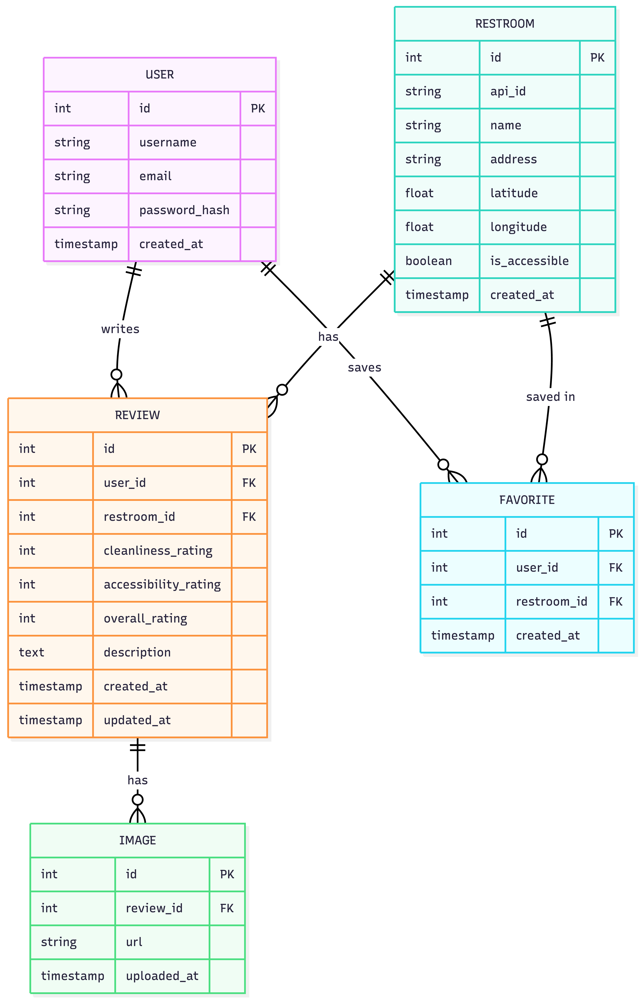

# Entity Relationship Diagram

Reference the Creating an Entity Relationship Diagram final project guide in the course portal for more information about how to complete this deliverable.

## Create the List of Tables

- User Table -  Stores account information for registered users
- Restroom Table -  Stores restroom data cached from the external public API.
- Review Table - Stores users' rating, reviews, etc
- Favorite Table - Stores user' restroom bookmarks
- Image Table -  Stores image URLs tied to a specific review

## Add the Entity Relationship Diagram

