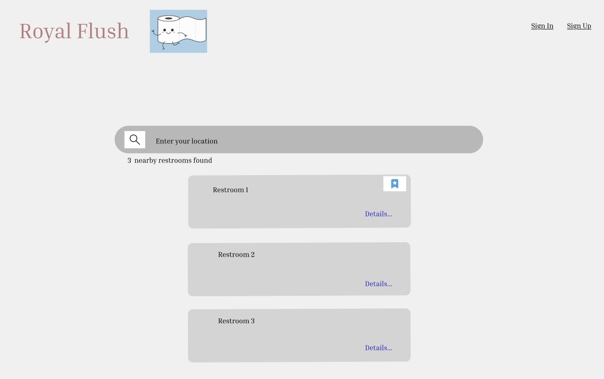
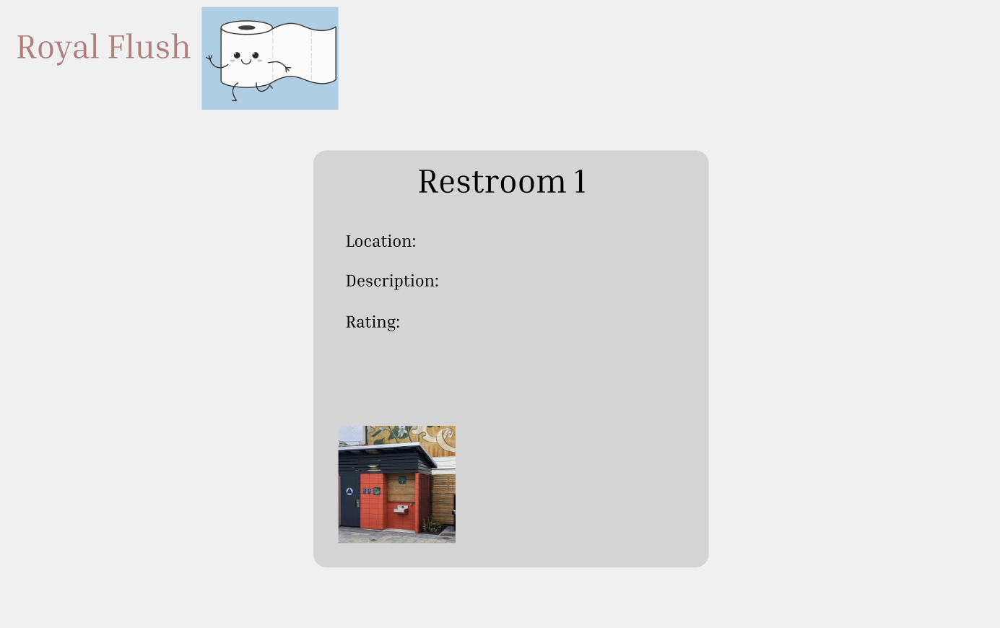
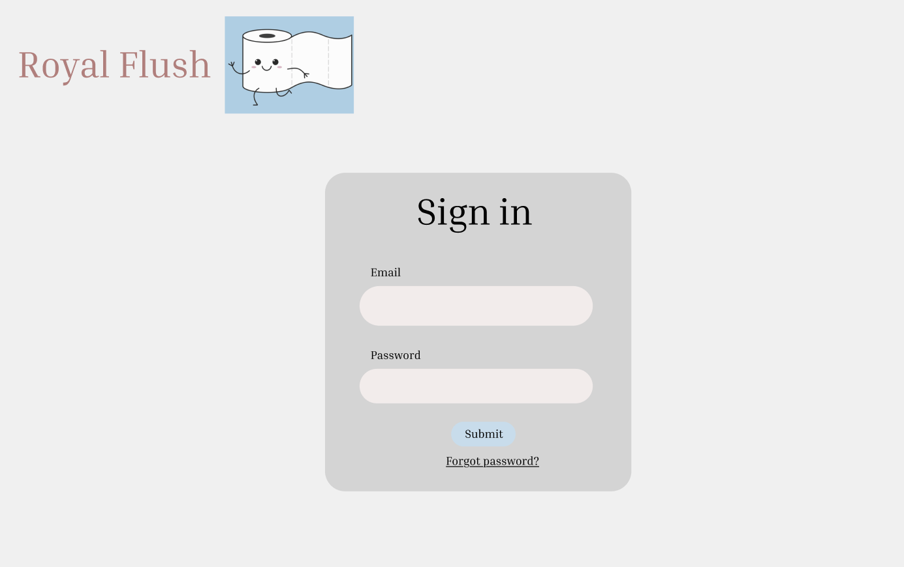

# Wireframes

Reference the Creating an Entity Relationship Diagram final project guide in the course portal for more information about how to complete this deliverable.

## List of Pages

- Home Page - search bar, list of nearby restrooms based on location, filter
- Restroom Detail Page - ratings, reviews, available images
- Review Page - review form
- Edit Review Page - update review
- Restroom Rankings Page - list of ranking restrooms based on user rating
- User Favorites Page - bookmarked restrooms for a user
- Login Page
- Signup Page
- User Profile Page

## Wireframe 1: Home Page

## Wireframe 2: Restroom Detail Page

## Wireframe 3: Review Page

[include wireframe here]

## Wireframe 4: Edit Review Page

[include wireframe here]

## Wireframe 5: Restroom Rankings Page

[include wireframe here]

## Wireframe 6: User Favorites Page

[include wireframe here]

## Wireframe 7: Login Page

## Wireframe 8: Signup Page

[include wireframe here]

## Wireframe 9: User Profile Page

[include wireframe here]
